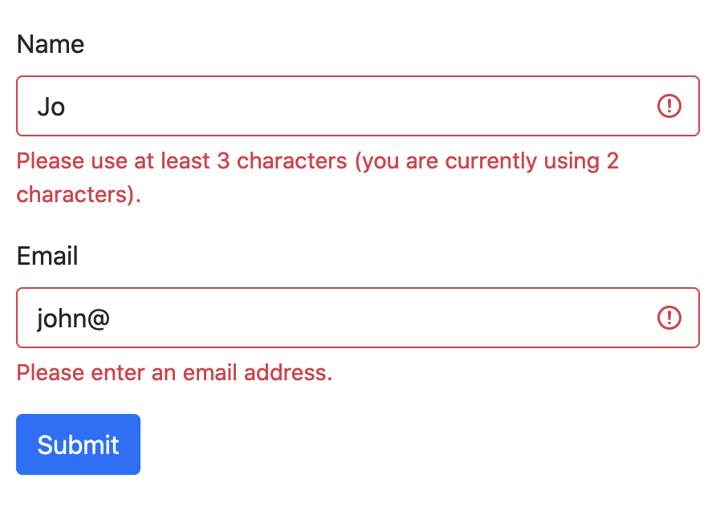

ember-bootstrap-constraint-validations
==============================================================================
[](https://github.com/kaliber5/ember-bootstrap-constraint-validations/actions/workflows/ci.yml)

This addon integration with [ember-bootstrap](https://www.ember-bootstrap.com/) to support form validations based on the
browser's native HTML5 [constraint validation API](https://developer.mozilla.org/en-US/docs/Web/Guide/HTML/Constraint_validation).
But instead of the browser's built-in validation UI, validation errors will be rendered using Bootstrap's [Custom Styles](https://getbootstrap.com/docs/5.2/forms/validation/#custom-styles).
See the [FormElement documentation](https://www.ember-bootstrap.com/api/classes/Components.FormElement.html) for
further details.


Compatibility
------------------------------------------------------------------------------

* Ember Bootstrap v5 or above
* Ember.js v3.24 or above
* Ember CLI v3.24 or above
* Node.js v12 or above


Installation
------------------------------------------------------------------------------

```
ember install ember-bootstrap-constraint-validations
```


Usage
------------------------------------------------------------------------------

Apply the HTML5 validation attributes as needed to your form controls. The form elements [`@controlType`](https://www.ember-bootstrap.com/api/classes/Components.FormElement.html#property_controlType)
argument will already apply the correct `type` attribute for the rendered `<input>` element. But you can also add 
additional HTML5 attributes like `required`, by applying them as attributes to the form control. 
For this you must use the block form syntax of form elements, so you can apply them to the yielded form `control` (which basically represents the `<input>`), 
and not the parent *element* (a wrapper `<div>`):

```hbs
<BsForm @model={{this.model}} as |form|>
  <form.element @label="Name" @property="name" as |el|>
    <el.control required minlength="3"/>
  </form.element>
  <form.element @controlType="email" @label="Email" @property="email" />
  <form.submitButton>Submit</form.submitButton>
</BsForm>
```

In this example we have defined a "Name" text field, which is `required` and has a `minlength` of 3, as well as an optional field of type
`email`. When submitting this form, or when focussing out of a field, the appropriate Bootstrap validation markup will be rendered:



Note that the error messages are natively provided by the browser itself, given by the form element's [`validationMessage`](https://developer.mozilla.org/en-US/docs/Web/API/Constraint_validation#validationmessage).


Contributing
------------------------------------------------------------------------------

See the [Contributing](CONTRIBUTING.md) guide for details.


License
------------------------------------------------------------------------------

This project is licensed under the [MIT License](LICENSE.md).
